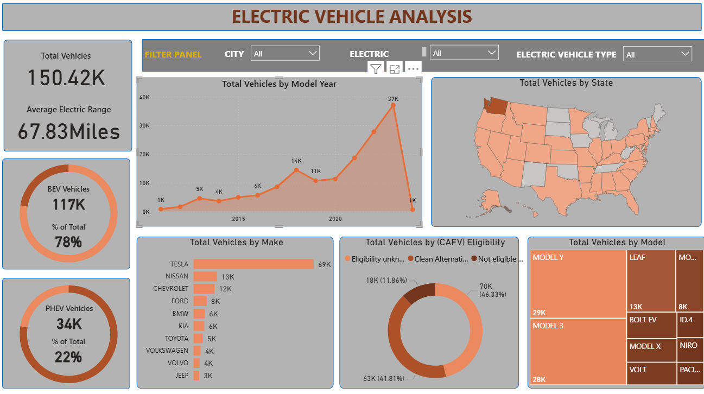

#  Power BI Projects

##  Tools Used

Electric Vehicle Analysis Dashboard

###  Business Problem
Analyse electric vehicle registration data across the USA to
understand EV adoption trends, manufacturer market share,
geographic distribution and electric range performance.

###  Dashboard Preview

###  Key Findings

| Metric | Result |
|--------|--------|
|  Total Vehicles | **150,482** |
|  Average Electric Range | **67.83 Miles** |
|  BEV Vehicles | **117K (78% of total)** |
|  PHEV Vehicles | **34K (22% of total)** |
|  Top Manufacturer | **Tesla — 69K vehicles** |
|  Second Manufacturer | **Nissan — 13K** |
|  Third Manufacturer | **Chevrolet — 12K** |
|  Peak Year | **2023 — 37K registrations** |
|  Top Model | **Model Y — 29K vehicles** |
|  CAFV Eligible | **41.81% of vehicles** |

###  Business Insights

**1. Tesla dominates with 46% market share**
Tesla accounts for nearly half of all EV registrations —
more than the next 5 manufacturers combined.

**2. Fully electric vehicles (BEV) are winning**
78% of vehicles are BEV vs 22% PHEV — showing strong
consumer shift toward fully electric vehicles.

**3. EV adoption is rapidly accelerating**
Registrations peaked at 37K in 2023 — showing massive
year on year growth compared to 1K in 2015.

**4. Washington state leads EV adoption**
The geographic map shows Washington as the dominant
state for EV registrations across the USA.

###  Power BI Skills Used
- DAX Measures — BEV %, PHEV %, Average Range
- Interactive Slicers — City, Electric type, Vehicle type
- Map Visual — geographic distribution by state
- Donut Charts — CAFV eligibility breakdown
- Treemap — top models by volume
- Line Chart — adoption trend by model year
- Bar Chart — manufacturer rankings

###  Files
 [Download Power BI File](Electric_Vehicle_Analysis.pbix)

Tell me when done — then we do the final GitHub step: pinning your best repos and we move to LinkedIn! 🚀Sonnet 4.6
